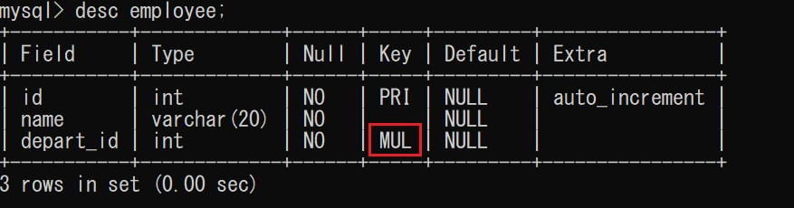

## 连接数据库

```sql
mysql -uroot -pA0ch1Shu4957 -- 连接数据库

update mysql.user set authentication_string=password('1234') where user='root' and Host = 'localhost'; -- 修改密码

describe test_tb; -- 显示数据库中test_tb表的信息
```


## 操作数据库

> Database -> Table -> Data

### 创建数据库

```sql
CREATE DATABASE IF NOT EXISTS test_db;
```

- `IF NOT EXISTS` 可选
  - 不写这句的话， 如果已经存在`test_db`则会报错

### 删除数据库

```sql
DROP DATABASE IF EXISTS test_db;
```

- `IF EXISTS` 可选
  - 不写这句的话， 如果没有`test_db`则会报错

### 使用数据库

```sql
USE test_db;
USE `user` -- 当数据库或者表的字段名是关键字， 则需要加上`
```

### 查看数据库

```sql
SHOW DATABASES;
```


## 数据库的类型（列）

[菜鸟教程](https://www.runoob.com/mysql/mysql-data-types.html)

[数据类型长度问题](https://blog.csdn.net/YAruli/article/details/79187814)

| 数值             |                        |              |
| ---------------- | ---------------------- | ------------ |
| `tinyint`        | 十分小的数据           | 1个字节      |
| `smallint`       | 较小的数据             | 2个字节      |
| `mediumint`      | 中等大小的的整数       | 3个字节      |
| **`int`** ★      | **标准的整数**         | **4个字节**  |
| `bigint`         | 较大的数据             | 8个字节      |
| `float`          | 浮点数                 | 4个字节      |
| `double`         | 浮点数                 | 8个字节      |
| **`decimal`**　★ | **字符串形式的浮点数** | **精度计算** |

| 字符串          |             |
| --------------- | ----------- |
| `char`          | 0~255       |
| **`varchar`** ★ | **0~65535** |
| `tinytext`      | 2^8 - 1     |
| **`text`** ★    | **2^16 -1** |

| 时间日期    |                         |          |
| ----------- | ----------------------- | -------- |
| `date`      | `YYYY-MM-DD`            | 日期格式 |
| `time`      | `HH：mm：ss`            | 时间格式 |
| `datetime`  | `YYYY-MM-DD HH：mm：ss` | 常用     |
| `timestamp` |                         | 时间戳   |
| `year`      |                         | 年份     |

| null |              |
| ---- | ------------ |
| NULL | 不能进行运算 |


## 数据库的字段属性

##### `UNSIGNED`

- 无符号的整数
- 声明后， 该列不能声明为负数

##### `ZEROFILL`

- 0填充

- 不足的位数，使用0来填充

  - ```sql
    id int(3) ZEROFILL -- 5 -> 005
    ```

##### `AUTO_INCREMENT`

- 自增， 自动在上一条记录的基础上+1
- 通常用来设计唯一的主键
- 必须是整数类型
- 可以自定义起始值和步长

##### `NOT NULL`

- 非空
- 默认为可以允许空值

##### `DEFAULT`

- 默认值

  

## 数据类型的补充

>  数值中INT（X）的X表示显示宽度而非长度

1. 创建数据库和表格

   ```sql
   create database if not exists test_db;
   
   create table test_tb(
   num_len int(2),
   num_fill int(2) zerofill,
   num_unsigned tinyint unsigned,
   num_normal tinyint);
   ```

   

2. INT(X): X表示显示宽度， 但需要和`zerofill`一同使用

   ```sql
   insert into test_tb values (1,0,0,0);
   insert into test_tb values (12,0,0,0);
   insert into test_tb values (123,0,0,0);
   ```

   

   ```sql
   insert into test_tb values (1,1,0,0);
   insert into test_tb values (12,12,0,0);
   insert into test_tb values (123,123,0,0);
   ```

   

3. `Unsigned`效果显示
	


> Varchar(X)中的X则跟长度相关， 为最大可设置长度

1. 创建表,并且设置字符串长度为2

   ```sql
   create table zifu(letter char(2));
   ```

2. 显示结果

   

   只能设定长度小于2的字符串

   

## 数据库引擎

### INNODB（默认）vs. MYISAM

|              |    INNODB     | MYISAM |
| ------------ | :-----------: | :----: |
| 事务支持     |       √       |   ×    |
| 数据行锁定   |       √       |   ×    |
| 外键约束     |       √       |   ×    |
| 全文索引     |       ×       |   √    |
| 表空间的大小 | 较大，约为2倍 |  较小  |

常规使用操作

- MYISAM 节约空间， 速度快
- INNODB 安全性高， 支持事务， 多表多用户操作

> 在物理空间存在的位置

所有的数据库文件都存在`data`目录下，本质还是文件的存储。

MySQL引擎在物理文件上的区别

- INNODB：在数据库表中只有一个`*.frm`文件，以及上级目录下的`ibdata`文件
- MYISAM：
  - `*.frm`：表结构的定义文件
  - `*.MTD` ：数据文件（data）
  - `*.MTI` ：索引文件（index）

> 设置数据库表的字符集编码

[mysql的默认字符编码的设置（my.ini设置字符编码）](https://www.jianshu.com/p/ec0c86ee3e04)

```sql
CHARSET=utf8
```

如果不设置的话，则会是mysql默认的字符集编码（不支持中文）

MySQL的默认编码是Latin1，不支持中文

在my.ini中配置默认的编码

```sql
character-set-server=utf8
```


## 修改和删除数据表字段

### 修改表名

```sql
-- ALTER TABLE 旧表名 REMANE AS 新表名
ALTER TABLE old_table_name RENAME AS new_table_name;
```

### 增加表的字段

```sql
-- ALTER TABLE 表名 ADD 字段名 列属性
ALTER TABLE table_name ADD new_column INT(11);
```

### 修改表的字段 （重命名， 修改约束）

```sql
-- ALTER TABLE 表名 MODIFY 字段名 列属性[]
ALTER TABLE table_name MODIFY column_name VARCHAR(11); -- 修改约束
-- ALTER TABLE 表名 CHANGE 旧表名 新表名 列属性[]
ALTER TABLE table_name CHANGE old_column_name new_column_name INT(11); -- 重命名
```

列中已经有元素的情况：

注意隐式转换

### 删除表的字段

```sql
-- ALTER TABLE 表名 DROP 列名
ALTER TABLE table_name DROP column_name;
```

### 删除表

```sq
DROP TABLE IF EXIST table_name;
```

==※所有的创建和删除操作尽量加上判断， 以免报错==

**注意点**

- 使用``包裹字段名
- 注释 -- /**/
- sql大小写不敏感 


## MySQL数据管理

### 外键（了解）

方式一：创建表的时候，增加约束（相对比较麻烦，复杂）

```sql
create table if not exists `depart`(
    `depart_id` int(3) not null auto_increment,
    `depart_name` varchar(20) not null,
    primary key (`depart_id`)
)ENGINE=INNODB DEFAULT CHARSET=utf8;

create table if not exists `employee`(
 `id` int(2) not null auto_increment comment '学号',
 `name` varchar(20) not null,
 `depart_id` int(2) not null,
  primary key (`id`),
  key `FK_depart_id` (`depart_id`),
  constraint `FK_depart_id` foreign key (`depart_id`) references `depart` (`depart_id`)
)ENGINE=INNODB DEFAULT CHARSET=utf8;
```

不能删除depart表因为存在外键引用，如果像删除该表则需要先删除表employee。

```sql
ERROR 3730 (HY000): Cannot drop table 'depart' referenced by a foreign key constraint 'FK_depart_id' on table 'employee'
```

方式二：创建表的时候没有外键关系， 修改表

```sql
create table if not exists `depart`(
    `depart_id` int(3) not null auto_increment,
    `depart_name` varchar(20) not null,
    primary key (`depart_id`)
)ENGINE=INNODB DEFAULT CHARSET=utf8;

create table if not exists `employee`(
 `id` int(2) not null auto_increment comment '学号',
 `name` varchar(20) not null,
 `depart_id` int(2) not null,
  primary key (`id`)
)ENGINE=INNODB DEFAULT CHARSET=utf8;

-- ALTER TABLE table_name ADD CONSTRAINT constraint_name FOREIGN KEY (column_name) REFERENCES second_table_name (second_column_name)
alter table `employee` add constraint `FK_depart_id` foreign key (`depart_id`) references `depart` (`depart_id`);
```



以上的操作都是物理外键，即数据库级别的外键， 不建议使用！

例如，删除表的时候，需要判断表之间的关系，相对麻烦。

最佳实践

- 数据库就是单纯的表， 只用来存数据， 只有行（数据）和列（字段）。
- 想用外键，使用程序去实现。

### DML语言（重点）

数据库意义: 数据存储，数据管理

**添加 ： `insert`**

```sql
insert into table_name (column1,column2...) values (values1,values2...),(values1,values2);
```

**修改 : `update`**

```sql
UPDATE table_name SET column1=value1, column2=value2 ... [WHERE condition];
```

- WHERE子句条件运算符：[条件运算符](https://blog.csdn.net/zhouzhiwengang/article/details/53437480)
- column_name是数据库的列， 尽量带上``
- 如果没有指定筛选的条件，会修改所有的列
- value是一个具体的值， 也可以是一个变量

**删除：`delete`**

```sql
DELETE FROM table_name [WHERE condition] -- 避免使用这种方式
```

**删除: `TRUNCATE`**

作用：完全清空一个数据库表， 表的结构和索引约束不会变。

```sql
TRUNCATE table_name
```

**`DELETE` vs. `TRUNCATE`**

相同点：删除数据， 不删除表结构

不同点：

- TRUNCATE 重新设置自增列，计数器会归零
- TRUNCATE  不会影响事务
- DELETE 重启数据库
  - INNODB 自增列会从1重新开始（存在内存当中的，断电即失）
  - MyISAM 继续从撒谎给你一个自增量开始（存在文件中的，不会丢失）


### DQL(Date Query Language)

**查询 `select`**

###### 别名 `AS`

```sql
-- 查询全部字段
SELECT * FROM table WHERE condition;

-- 查询指定字段
SELECT column FROM table WHERE condition;

-- 别名， 给结果起一个名字： AS
SELECT old_column AS new_column FROM table WHERE condition;

-- 函数
-- concat（a, b)
SELECT CONCAT('word', column) FROM table;
```

> ※有的时候， 列名字不是那么的见名知意， 可以使用AS来起别名。

###### 去重 `DISTINCT`

```sql
-- 去除SELECT查询出来的结果中重复的数据， 重复的数据只显示一条
SELECT DISTINCT column FROM table;
```

###### 其他

```sql
-- 查询系统版本・函数
SELECT VERSION();
-- 计算・表达式
SELECT 6+17 AS result 
-- 查询自增的步长
SELECT @@auto_increment_increment
```

数据库中的表达式：文本值，列，NULL，函数，计算表达式，系统变量，...

> SELECT expression FROM table

### where条件子句

作用：检索数据中**符合条件**的值， 搜索条件是由一个或者多个表达式组成。 结果为布尔值。

- 逻辑运算符

- `BETWEEN` X `AND` Y

- X `IS` (`NOT`) `NULL` 

- X `LIKE` Y

  - `%` : 表示0到任意个字符

  - `_` : 表示1个字符

  - ```sql
    -- NAME : Liang Li Liu Lu Lans
    
    -- Result: Liang Li Liu
    SELECT * FROM employee WHERE name LIKE 'Li%';
    
    -- Result: Liu
    SELECT * FROM employee WHERE name LIKE 'Li_';
    ```

- X `IN` Y

  - ```sql
    -- NAME : Liang Li Liu Lu Lans
    
    -- Result: Liang Li Liu
    SELECT * FROM employee WHERE name in ('Liang', 'Li', 'Liu')
    ```

### 联表查询

#### `JOIN`

